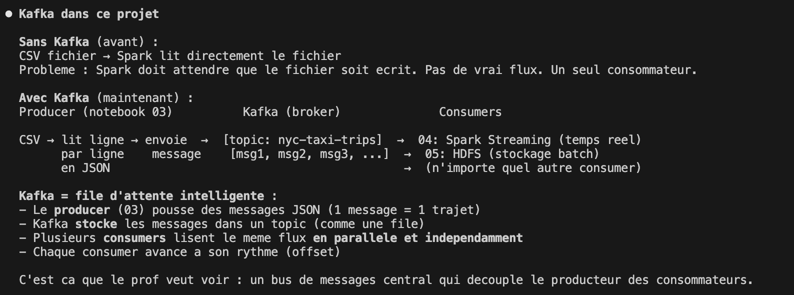
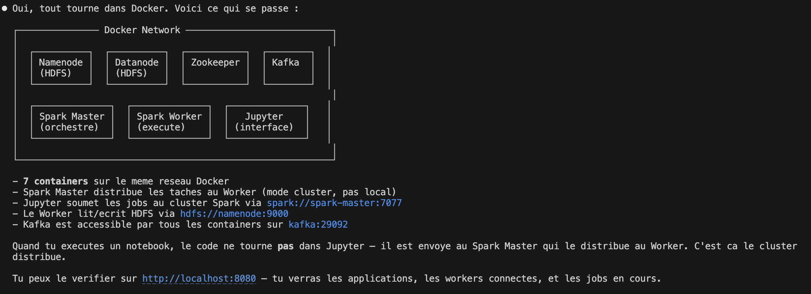
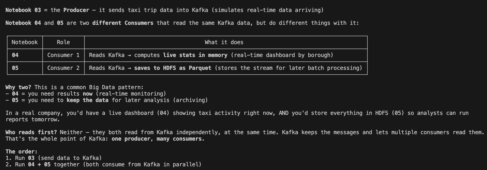

# NYC Taxi - Big Data Pipeline

Pipeline Big Data pour l'analyse des courses de taxi a New York, utilisant une architecture **Medallion** (Bronze / Silver / Gold) avec HDFS, Apache Kafka, Apache Spark et Jupyter.

## Architecture

```
        CSV (fact_trips_sample.csv)
                    |
          ┌─── 03_kafka_producer ───┐
          |      (Producer)         |
          ▼                         |
    ┌──────────┐                    |
    │  KAFKA   │  topic:            |
    │ (broker) │  nyc-taxi-trips    |
    └────┬─────┘                    |
         │                          |
    ┌────┴────┐                     |
    ▼         ▼                     ▼
 04_kafka   05_kafka        HDFS (Bronze)
 _spark     _to_hdfs             |
 _streaming    │           01_bronze_to_silver
    │          │                 |
    ▼          ▼           HDFS (Silver)
 In-memory  HDFS                 |
 (live)   (streaming/)     02_silver_to_gold
                                 |
                           HDFS (Gold)
```

### Flux de donnees

| Chemin | Description |
|--------|-------------|
| **Batch** : CSV → HDFS Bronze → Silver → Gold | Traitement par lot classique (notebooks 01 + 02) |
| **Streaming** : CSV → Kafka → Spark Streaming | Agregations temps reel (notebooks 03 + 04) |
| **Kafka → HDFS** : Kafka → Parquet sur HDFS | Stockage du flux pour batch ulterieur (notebook 05) |

### Services Docker

| Service | Port | Role |
|---------|------|------|
| **Namenode** | `9870` (Web UI), `9000` (RPC) | Maitre HDFS - gere les metadonnees |
| **Datanode** | - | Stockage des blocs de donnees HDFS |
| **Zookeeper** | `2181` | Coordinateur du cluster Kafka |
| **Kafka** | `9092` (externe), `29092` (interne) | Bus de messages - recoit et distribue les trajets |
| **Spark Master** | `8080` (Web UI), `7077` (RPC) | Orchestre les jobs Spark |
| **Spark Worker 1** | - | Execute les taches Spark — dedie au batch (2GB RAM, 3 cores) |
| **Spark Worker 2** | - | Execute les taches Spark — dedie au streaming (2GB RAM, 3 cores) |
| **Jupyter** | `8888` | Interface notebook PySpark |

## Scaling horizontal — 2 Workers Spark

### Pourquoi 2 workers ?

Dans un cluster Spark, chaque job (notebook) reserve des **cores** sur les workers pour executer ses taches. Avec un seul worker a 2 cores, un seul job peut tourner a la fois — si un deuxieme notebook tente de se connecter, il reste bloque en attente.

En ajoutant un **deuxieme worker**, le cluster dispose de **4 cores au total** (2 par worker). Spark Master distribue automatiquement les jobs sur les workers disponibles :

```
                    ┌──────────────────┐
                    │   SPARK MASTER   │
                    │  (orchestrateur) │
                    └────────┬─────────┘
                             │
                   ┌─────────┴─────────┐
                   │                   │
          ┌────────▼────────┐ ┌────────▼────────┐
          │  SPARK WORKER 1 │ │  SPARK WORKER 2 │
          │  3 cores / 2 GB │ │  3 cores / 2 GB │
          │                 │ │                 │
          │  Job: Notebook  │ │  Job: Notebook  │
          │  04 (streaming) │ │  05 (HDFS)      │
          └─────────────────┘ └─────────────────┘
```

### Comment ca marche ?

1. **Spark Master** recoit les demandes de connexion des notebooks
2. Quand un notebook cree une `SparkSession`, le Master lui attribue des cores sur un worker disponible
3. Avec 2 workers, **deux notebooks peuvent tourner en parallele** — chacun sur son propre worker
4. C'est le principe du **scaling horizontal** : on ajoute des machines plutot que de rendre une seule machine plus puissante

### Execution en parallele

Avec 2 workers, voici comment executer les notebooks de streaming en parallele :

1. Ouvrir **notebook 04** dans un onglet Jupyter → Run All
2. Ouvrir **notebook 05** dans un **autre onglet** → Run All
3. Les deux consumers Kafka tournent simultanement, chacun sur son propre worker

Vous pouvez verifier sur le Spark UI (http://localhost:8080) que les deux workers sont actifs avec chacun un job en cours.

### Scaling en production

En production, un cluster Spark peut avoir **des centaines de workers** repartis sur plusieurs machines physiques. Le principe reste le meme :
- Plus de workers = plus de jobs en parallele
- Plus de cores par worker = plus de taches par job
- Le Master gere l'allocation automatiquement (FIFO par defaut, ou FAIR scheduling)

## Donnees

4 fichiers CSV a placer dans `data/` (non inclus dans le repo) :

| Fichier | Description | Taille |
|---------|-------------|--------|
| `fact_trips_sample.csv` | 1M courses de taxi | ~25 MB |
| `dim_data.csv` | Dimension dates (366 jours) | ~10 KB |
| `dim_localizacao.csv` | Dimension localisations (263 zones) | ~10 KB |
| `dim_clima.csv` | Dimension meteo (38 entrees) | ~1 KB |

## Notebooks

### 01 - Bronze to Silver (Batch)
- Lecture des CSV bruts depuis HDFS
- Traduction des colonnes (portugais -> anglais)
- Nettoyage : suppression des doublons, filtrage des valeurs aberrantes, gestion des nulls /  a faire : supprimer de cle primaire null , ajouter weather data
- Ecriture en format Parquet sur HDFS

### 02 - Silver to Gold (Batch)
5 agregations metier :
1. **Stats par borough** : nb trajets, distance moyenne, tarif moyen, revenu total
2. **Stats mensuelles** : evolution mensuelle des trajets et revenus
3. **Top 10 zones** : zones de pickup les plus frequentees
4. **Impact meteo** : correlation entre meteo et activite taxi
5. **Matrice OD** : top 20 des paires origine-destination

// a faire : ajouter ds metrics : utiliser sparkml par exemple

### 03 - Kafka Producer
- Lit le CSV ligne par ligne
- Envoie chaque trajet comme message JSON dans le topic Kafka `nyc-taxi-trips`
- Simule un flux de donnees temps reel

### 04 - Kafka → Spark Streaming (Consumer 1)
- Spark Structured Streaming lit le flux Kafka
- Enrichit les trajets avec les zones (jointure avec `locations`)
- Calcule des agregations en temps reel par borough
- Resultats consultables via SQL en memoire

### 05 - Kafka → HDFS (Consumer 2)
- Spark Structured Streaming lit le flux Kafka
- Ecrit les messages en format Parquet sur HDFS
- Les donnees sont disponibles pour le traitement batch ulterieur

## Comment lancer le projet

### Pre-requis
- Docker et Docker Compose installes
- Les 4 fichiers CSV dans le dossier `data/`

### 1. Demarrer les containers

```bash
docker-compose up -d
```

### 2. Charger les donnees dans HDFS

```bash
# Creer les dossiers dans HDFS
docker exec namenode hdfs dfs -mkdir -p /projet/bronze

# Charger les CSV
docker exec namenode hdfs dfs -put /data/fact_trips_sample.csv /projet/bronze/
docker exec namenode hdfs dfs -put /data/dim_data.csv /projet/bronze/
docker exec namenode hdfs dfs -put /data/dim_localizacao.csv /projet/bronze/
docker exec namenode hdfs dfs -put /data/dim_clima.csv /projet/bronze/

# Ouvrir les permissions
docker exec namenode hdfs dfs -chmod -R 777 /projet/
```

### 3. Ouvrir Jupyter

Recuperer le token :
```bash
docker logs jupyter 2>&1 | grep "token="
```

Ouvrir dans le navigateur :
```
http://127.0.0.1:8888/lab?token=<VOTRE_TOKEN>
```

### 4. Executer les notebooks

**Partie Batch (traitement par lot) :**
1. `01_bronze_to_silver.ipynb` - nettoie les donnees brutes
2. `02_silver_to_gold.ipynb` - cree les agregations metier

**Partie Streaming (temps reel via Kafka) :**
3. `03_kafka_producer.ipynb` - envoie les trajets dans Kafka
4. `04_kafka_spark_streaming.ipynb` - agregations temps reel depuis Kafka
5. `05_kafka_to_hdfs.ipynb` - stocke le flux Kafka dans HDFS

> **Note** : Lancez le producer (03) d'abord, puis ouvrez les consumers (04 et 05) dans des onglets separes. Grace aux 2 workers Spark, les notebooks 04 et 05 peuvent tourner **en parallele** — chacun sur son propre worker.

### Interfaces web

- HDFS : http://localhost:9870
- Spark Master : http://localhost:8080

### Arreter le projet

```bash
docker-compose down
```

## Guide de test — ce que vous devez voir

### Etape 1 : Verifier les containers

```bash
docker ps --format "table {{.Names}}\t{{.Status}}"
```

Resultat attendu : 8 containers running

```
NAMES           STATUS
namenode        Up (healthy)
datanode        Up (healthy)
zookeeper       Up
kafka           Up
spark-master    Up
spark-worker-1  Up
spark-worker-2  Up
jupyter         Up
```

### Etape 2 : Verifier HDFS

Ouvrir http://localhost:9870 → Utilities → Browse the file system → `/projet/bronze/`

Resultat attendu : les 4 fichiers CSV sont visibles.

### Etape 3 : Notebook 01 — Bronze to Silver

| Cellule | Resultat attendu |
|---------|-----------------|
| Cell 1 | `Spark connecte` |
| Cell 2 | `Trips: 1000000 lignes` + tableau avec 5 lignes |
| Cell 3 | Colonnes traduites : `date_id, pickup_location_id, dropoff_location_id, weather_id, trip_distance, total_amount` |
| Cell 4 | Schema + statistiques (min, max, mean) |
| Cell 5 | Nulls par colonne (`weather_id` ~898898 nulls) |
| Cell 6 | `Avant: 1000000` / `Apres: ~982149` / `~1.8% supprimees` |
| Cell 7 | `Bronze -> Silver TERMINE` |

Verifier HDFS : `/projet/silver/` → 4 dossiers (`trips_clean/`, `dates_clean/`, `locations_clean/`, `weather_clean/`)

### Etape 4 : Notebook 02 — Silver to Gold

| Cellule | Resultat attendu |
|---------|-----------------|
| Cell 1 | `Spark connecte` |
| Cell 2 | `Trips Silver: ~982149 lignes` |
| Cell 3 | Stats par borough — Manhattan en tete (~481K trajets) |
| Cell 4 | Stats mensuelles — 12 mois, ~70-90K trajets/mois |
| Cell 5 | Top 10 zones — Melrose South, Jamaica, Union Sq... |
| Cell 6 | Impact meteo — correlation precipitation/temperature et activite taxi |
| Cell 7 | Matrice OD top 20 + `Silver -> Gold TERMINE` |

Verifier HDFS : `/projet/gold/` → 5 dossiers (`stats_par_borough/`, `stats_par_mois/`, `top_zones/`, `stats_meteo/`, `od_matrix/`)

Verifier Spark UI : http://localhost:8080 → jobs completes visibles

### Etape 5 : Notebook 03 — Kafka Producer

| Cellule | Resultat attendu |
|---------|-----------------|
| Cell 1 | `kafka-python installe` |
| Cell 2 | `Producer connecte a kafka:29092` |
| Cell 3 | `500 messages envoyes...` / `1000 messages envoyes...` / ... / `Termine : 25000 messages envoyes dans le topic "nyc-taxi-trips"` |
| Cell 4 | Apercu de 3 messages JSON : `{'date_id': ..., 'pickup_location_id': ..., ...}` |

### Etape 6 : Notebook 04 — Kafka → Spark Streaming

Ouvrir dans un **nouvel onglet** Jupyter.

| Cellule | Resultat attendu |
|---------|-----------------|
| Cell 1 | `Spark connecte` / `Locations: 263 zones` |
| Cell 2 | `Flux Kafka connecte` |
| Cell 3 | `Streaming Kafka → Spark demarre` |
| Cell 4, 5, 6 | Tableau avec boroughs — **les chiffres augmentent a chaque execution** (preuve du temps reel) |
| Cell 7 | `Streaming arrete` |

Resultat type :

```
+-------------+---------------+-----------+-----------------+
|      borough|nb_trajets_live|revenu_live|distance_moy_live|
+-------------+---------------+-----------+-----------------+
|    Manhattan|          12000|  288000.00|             3.96|
|        Bronx|           5400|  165000.00|             4.10|
|       Queens|           4200|  173000.00|             8.54|
|     Brooklyn|           2600|   67000.00|             6.69|
|Staten Island|            280|    7700.00|             3.15|
+-------------+---------------+-----------+-----------------+
```

### Etape 7 : Notebook 05 — Kafka → HDFS

| Cellule | Resultat attendu |
|---------|-----------------|
| Cell 1 | `Spark connecte` |
| Cell 2 | `Flux Kafka connecte` |
| Cell 3 | `Kafka → HDFS demarre` |
| Cell 4 | `Lignes stockees dans HDFS : XXXX` + tableau |
| Cell 5 | Compteur plus grand (donnees qui s'accumulent) |
| Cell 6 | `Kafka → HDFS arrete` + total final |

Verifier HDFS : `/projet/streaming/kafka_trips/` → fichiers `.parquet`

### Resume : points cles pour la validation

| Critere | Comment verifier |
|---------|-----------------|
| **HDFS fonctionne** | Donnees visibles sur http://localhost:9870 (Bronze, Silver, Gold) |
| **Spark cluster** | Jobs visibles sur http://localhost:8080 |
| **Pipeline Batch** | Bronze (CSV) → Silver (Parquet propre) → Gold (agregations) |
| **Kafka Producer** | Messages envoyes dans le topic `nyc-taxi-trips` |
| **Consumer Spark** | Agregations temps reel — chiffres augmentent a chaque re-execution |
| **Consumer HDFS** | Flux Kafka stocke en Parquet sur HDFS pour batch ulterieur |

## Stack technique

- **Messaging** : Apache Kafka 7.5 (Confluent)
- **Stockage** : HDFS (Hadoop 3.2.1)
- **Traitement** : Apache Spark 3.5.0 (PySpark)
- **Interface** : Jupyter Notebook
- **Conteneurisation** : Docker Compose




